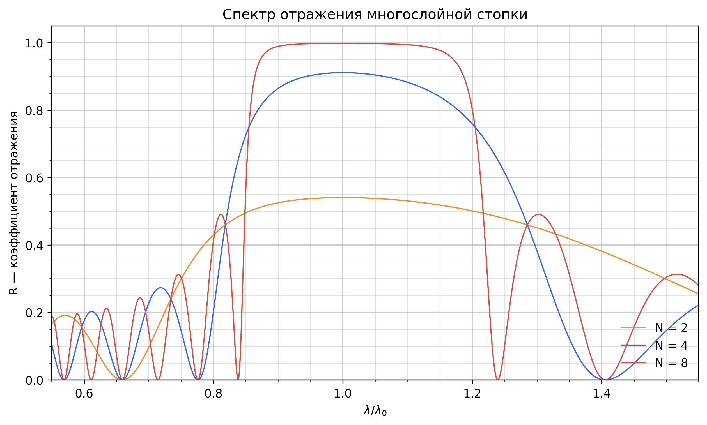
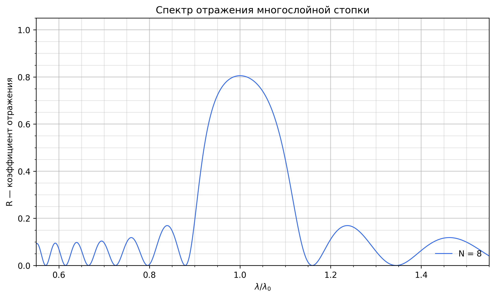
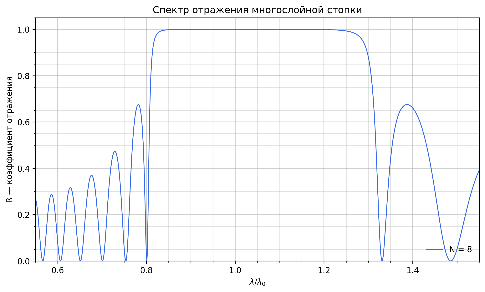
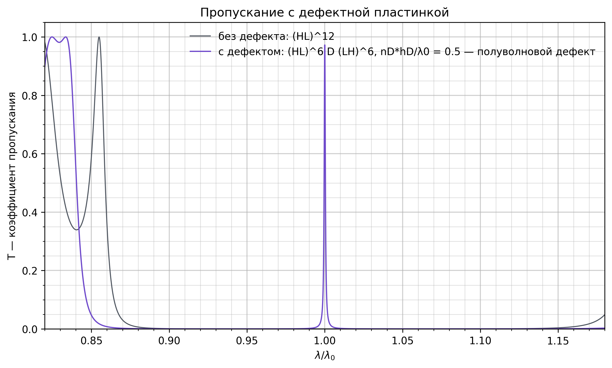
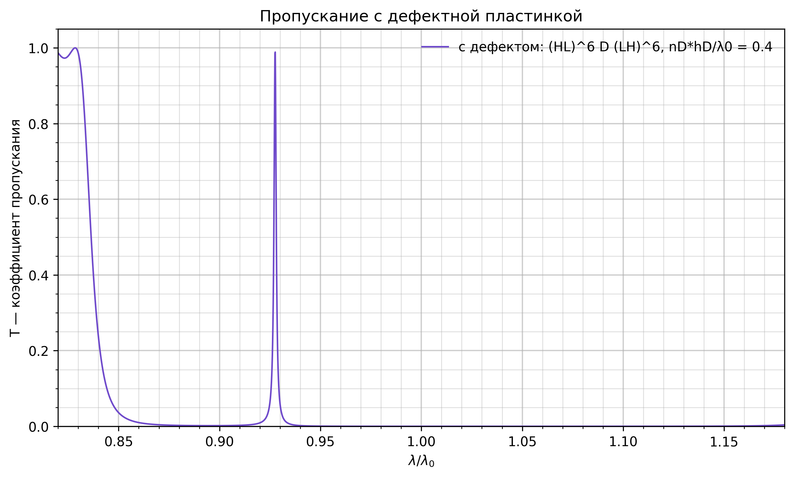
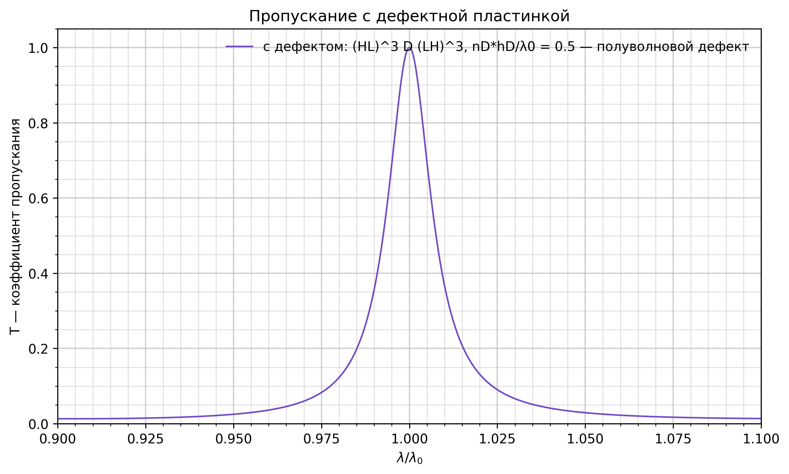

# Одномерный фотонный кристалл

Расчёт спектров отражения и пропускания многослойной диэлектрической структуры
при нормальном падении. Учебный мини-проект: брэгговское зеркало (HL)^N и та же
структура с дефектным слоем в середине.

## Метод

Каждый слой описывается характеристической матрицей 2×2

    M = [[ cos δ,        i·sin δ / n ],
         [ i·n·sin δ,    cos δ       ]],    δ = 2π·n·h / λ

Матрица всей стопки — произведение матриц слоёв, из неё выражаются амплитудные
коэффициенты r и t с учётом сред слева и справа (в работе — воздух).
Дальше R = |r|², T = |t|²·n_out/n_in.

Все длины задаются в долях расчётной длины волны λ₀. Четвертьволновой слой —
это n·h/λ₀ = 1/4, полуволновой — 1/2. Интерфейс подсказывает, когда введённые
толщины попадают в эти условия.

## Файлы

- `optical_core.py` — матрица слоя, матрица стопки, r/t, сборка структур
  (HL)^N и (HL)^N D (LH)^N.
- `reflection.py` — окно со спектром R для нескольких N сразу.
- `transmission.py` — окно со спектром T структуры с дефектом, рядом для
  сравнения — обычная стопка той же суммарной длины.
- `Graphiks/` — сохранённые графики к отчёту.
- `Photon_Crystal (7).pdf` — отчёт.

## Запуск

Нужны Python 3.10+, numpy, matplotlib и tkinter.

    python reflection.py
    python transmission.py

Параметры (толщины, показатели, число периодов, диапазон λ/λ₀) правятся прямо
в окне. Числа можно вводить как `0.125`, `0,125` или `1/8`.

## Результаты

Отражение (HL)^N при n_H = 2, n_L = 1.25, четвертьволновые слои. С ростом N
запрещённая зона выходит на плато R ≈ 1, края становятся резкими, снаружи
появляются боковые лепестки.

Ширина зоны определяется контрастом n_H/n_L: при n_H = 1.5 (слева) зона узкая
и при N = 8 не дотягивает до единицы, при n_H = 2.5 (справа) — широкая и полная.

| n_H = 1.5 | n_H = 2.5 |
|---|---|
|  |  |

Полуволновой дефект (HL)^6 D (LH)^6 открывает в середине запрещённой зоны
узкое окно пропускания с T = 1 — резонанс Фабри–Перо между двумя зеркалами.
Обычная стопка (HL)^12 той же длины в этом месте не пропускает ничего.

Толщина дефекта сдвигает резонанс: при n_D·h_D/λ₀ = 0.4 пик уходит влево от
λ₀, при 0.6 — вправо. Число периодов N задаёт добротность: при N = 3 пик
широкий, при N = 9 — почти линия.

| n_D·h_D/λ₀ = 0.4 | N = 3 |
|---|---|
|  |  |
